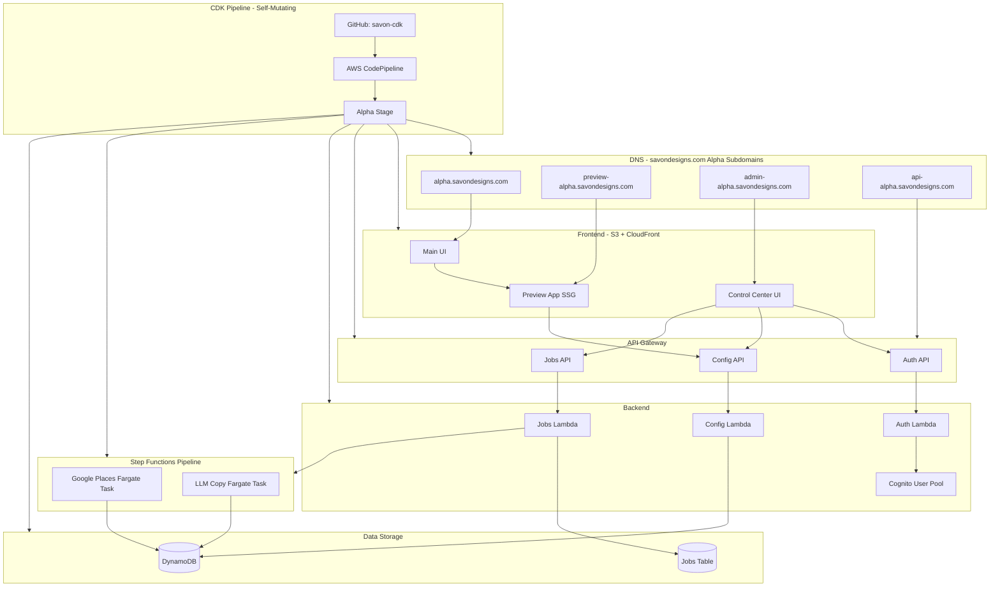

# Savon Platform Infrastructure and Pipeline Plan

## Architecture Overview



---

## Alpha Domains

| Service | Domain |
|---------|--------|
| Main UI | `alpha.savondesigns.com` |
| Preview App | `preview-alpha.savondesigns.com` |
| Control Center | `admin-alpha.savondesigns.com` |
| API Gateway | `api-alpha.savondesigns.com` |

---

## CDK Best Practices Applied

1. **Use L2 constructs** - `dynamodb.Table`, `lambda.Function`, `cloudfront.Distribution` (not L1 CfnXxx)
2. **Let CDK generate resource names** - No hardcoded `tableName`, `functionName`, etc.
3. **Use `grant*()` methods** - `table.grantReadWriteData(lambda)`, `secret.grantRead(lambda)`
4. **Secrets at runtime** - Pass ARN as env var, call `GetSecretValue` in Lambda code
5. **Separate stacks** - Stateful (DynamoDB) vs Stateless (Lambda/API) for safer deployments
6. **CDK Pipelines** - Self-mutating pipeline with GitHub source
7. **DESTROY removal policies** - All resources use `RemovalPolicy.DESTROY` for fast iteration (add RETAIN before production)

---

## Phase 0: GitHub Integration Setup

### 0.1 Create GitHub Connection (One-Time, Manual)

CDK Pipelines uses AWS CodeStar Connections to access your GitHub repository.

**Step-by-step:**

1. **Go to AWS Console** → CodePipeline → Settings → Connections
2. **Click "Create connection"**
3. **Select "GitHub"** as the provider
4. **Name it**: `savon-github-connection`
5. **Click "Connect to GitHub"** - this opens a popup
6. **Authorize AWS Connector for GitHub** in the popup
7. **Select your GitHub account** or install the app if needed
8. **Click "Connect"** - the connection status should be "Available"
9. **Copy the connection ARN** - you'll need it for CDK (format: `arn:aws:codestar-connections:us-east-1:328174020207:connection/xxxxx`)

### 0.2 Store Connection ARN

Add to your environment or a config file:

```bash
# In your shell or CI environment
export GITHUB_CONNECTION_ARN="arn:aws:codestar-connections:us-east-1:328174020207:connection/YOUR-CONNECTION-ID"
```

Or create a cdk.context.json:

```json
{
  "githubConnectionArn": "arn:aws:codestar-connections:us-east-1:328174020207:connection/YOUR-CONNECTION-ID",
  "githubOwner": "your-github-username",
  "githubRepo": "savon-cdk"
}
```

---

## Phase 1: CDK Pipeline Stack

### 1.1 Pipeline Stack Organization

The pipeline itself is defined in a separate stack that deploys your application stacks as stages:

```typescript
// bin/savon-cdk.ts
import * as cdk from 'aws-cdk-lib';
import { PipelineStack } from '../lib/pipeline-stack';

const app = new cdk.App();

// The pipeline stack - this is the only stack you deploy manually
new PipelineStack(app, 'SavonPipeline', {
  env: { account: '328174020207', region: 'us-east-1' },
});
```

### 1.2 Pipeline Stack Definition

```typescript
// lib/pipeline-stack.ts
import * as cdk from 'aws-cdk-lib';
import { Construct } from 'constructs';
import * as pipelines from 'aws-cdk-lib/pipelines';
import { AlphaStage } from './stages/alpha-stage';

export class PipelineStack extends cdk.Stack {
  constructor(scope: Construct, id: string, props?: cdk.StackProps) {
    super(scope, id, props);

    // Get GitHub connection from context
    const connectionArn = this.node.tryGetContext('githubConnectionArn') 
      || process.env.GITHUB_CONNECTION_ARN;
    const githubOwner = this.node.tryGetContext('githubOwner') || 'your-github-username';
    const githubRepo = this.node.tryGetContext('githubRepo') || 'savon-cdk';

    // Self-mutating CDK Pipeline
    const pipeline = new pipelines.CodePipeline(this, 'Pipeline', {
      pipelineName: 'SavonPipeline',
      
      // Self-mutation: pipeline updates itself when you push changes
      selfMutation: true,
      
      // GitHub source using CodeStar Connection
      synth: new pipelines.ShellStep('Synth', {
        input: pipelines.CodePipelineSource.connection(
          `${githubOwner}/${githubRepo}`,
          'main',
          { connectionArn }
        ),
        commands: [
          'npm ci',
          'npm run build',
          'npx cdk synth',
        ],
      }),
      
      // Docker builds needed for ECS Fargate tasks
      dockerEnabledForSynth: true,
      dockerEnabledForSelfMutation: true,
    });

    // Add Alpha stage - single stage for early development
    pipeline.addStage(new AlphaStage(this, 'Alpha', {
      env: { account: '328174020207', region: 'us-east-1' },
    }));
  }
}
```

### 1.3 Alpha Stage Definition

```typescript
// lib/stages/alpha-stage.ts
import * as cdk from 'aws-cdk-lib';
import { Construct } from 'constructs';
import { StatefulStack } from '../stacks/stateful-stack';
import { AppStack } from '../stacks/app-stack';

export class AlphaStage extends cdk.Stage {
  constructor(scope: Construct, id: string, props?: cdk.StageProps) {
    super(scope, id, props);

    // Stateful resources (DynamoDB tables)
    const statefulStack = new StatefulStack(this, 'Stateful', {
      // No termination protection for alpha - we want fast iteration
    });

    // Application resources (Lambda, API Gateway, ECS, CloudFront, etc.)
    new AppStack(this, 'App', {
      businessesTable: statefulStack.businessesTable,
      jobsTable: statefulStack.jobsTable,
    });
  }
}
```

### 1.4 Initial Deployment

After creating the GitHub connection:

```bash
# First time only - bootstrap CDK
npx cdk bootstrap aws://328174020207/us-east-1

# Deploy the pipeline stack (this is the only manual deploy)
npx cdk deploy SavonPipeline

# After this, all future deployments happen automatically via git push!
```

**Important:** After the initial deploy, the pipeline is self-mutating. Every `git push` to `main` triggers:

1. Pipeline updates itself if `lib/pipeline-stack.ts` changed
2. Synthesizes CDK app
3. Deploys Alpha stage

---

## Phase 2: Stateful Stack (DynamoDB)

```typescript
// lib/stacks/stateful-stack.ts
import * as cdk from 'aws-cdk-lib';
import * as dynamodb from 'aws-cdk-lib/aws-dynamodb';
import { Construct } from 'constructs';

export interface StatefulStackProps extends cdk.StackProps {}

export class StatefulStack extends cdk.Stack {
  public readonly businessesTable: dynamodb.Table;
  public readonly jobsTable: dynamodb.Table;

  constructor(scope: Construct, id: string, props?: StatefulStackProps) {
    super(scope, id, props);

    // Businesses table
    this.businessesTable = new dynamodb.Table(this, 'Businesses', {
      partitionKey: { name: 'place_id', type: dynamodb.AttributeType.STRING },
      billingMode: dynamodb.BillingMode.PAY_PER_REQUEST,
      pointInTimeRecovery: true,
      // DESTROY for fast iteration - change to RETAIN before production!
      removalPolicy: cdk.RemovalPolicy.DESTROY,
    });

    // GSI for searching by business_type + state
    this.businessesTable.addGlobalSecondaryIndex({
      indexName: 'by-type-state',
      partitionKey: { name: 'business_type', type: dynamodb.AttributeType.STRING },
      sortKey: { name: 'state', type: dynamodb.AttributeType.STRING },
    });

    // GSI for searching by friendly_slug
    this.businessesTable.addGlobalSecondaryIndex({
      indexName: 'by-slug',
      partitionKey: { name: 'friendly_slug', type: dynamodb.AttributeType.STRING },
    });

    // Jobs table
    this.jobsTable = new dynamodb.Table(this, 'Jobs', {
      partitionKey: { name: 'job_id', type: dynamodb.AttributeType.STRING },
      sortKey: { name: 'created_at', type: dynamodb.AttributeType.STRING },
      billingMode: dynamodb.BillingMode.PAY_PER_REQUEST,
      timeToLiveAttribute: 'expires_at',
      // DESTROY for fast iteration
      removalPolicy: cdk.RemovalPolicy.DESTROY,
    });

    // Outputs
    new cdk.CfnOutput(this, 'BusinessesTableName', {
      value: this.businessesTable.tableName,
    });
    new cdk.CfnOutput(this, 'JobsTableName', {
      value: this.jobsTable.tableName,
    });
  }
}
```

---

## Phase 3: App Stack

```typescript
// lib/stacks/app-stack.ts
import * as cdk from 'aws-cdk-lib';
import * as dynamodb from 'aws-cdk-lib/aws-dynamodb';
import * as lambda from 'aws-cdk-lib/aws-lambda';
import * as apigwv2 from 'aws-cdk-lib/aws-apigatewayv2';
import * as cognito from 'aws-cdk-lib/aws-cognito';
import * as s3 from 'aws-cdk-lib/aws-s3';
import * as cloudfront from 'aws-cdk-lib/aws-cloudfront';
import * as origins from 'aws-cdk-lib/aws-cloudfront-origins';
import * as ecs from 'aws-cdk-lib/aws-ecs';
import * as ec2 from 'aws-cdk-lib/aws-ec2';
import * as sfn from 'aws-cdk-lib/aws-stepfunctions';
import * as secretsmanager from 'aws-cdk-lib/aws-secretsmanager';
import { HttpLambdaIntegration } from 'aws-cdk-lib/aws-apigatewayv2-integrations';
import { HttpUserPoolAuthorizer } from 'aws-cdk-lib/aws-apigatewayv2-authorizers';
import { Construct } from 'constructs';

export interface AppStackProps extends cdk.StackProps {
  businessesTable: dynamodb.ITable;
  jobsTable: dynamodb.ITable;
}

export class AppStack extends cdk.Stack {
  constructor(scope: Construct, id: string, props: AppStackProps) {
    super(scope, id, props);

    // ... See sections below for component details
  }
}
```

### 3.1 Config Lambda

Create [src/config-lambda/index.ts](savon-cdk/src/config-lambda/index.ts) with endpoints:

- `GET /businesses` - List with pagination (DynamoDB Scan with LastEvaluatedKey)
- `GET /businesses/{place_id}` - Get single record
- `PUT /businesses/{place_id}` - Update record
- `POST /businesses/import` - CSV import (parse CSV, batch write)
- `GET /businesses/export` - CSV export (scan all, stream as CSV)
- `GET /businesses/search?q=term` - Full-text search (scan with contains filter)

### 3.2 S3 + CloudFront (Alpha Domains)

```typescript
import * as acm from 'aws-cdk-lib/aws-certificatemanager';
import * as route53 from 'aws-cdk-lib/aws-route53';
import * as route53Targets from 'aws-cdk-lib/aws-route53-targets';

// Import ACM certificate (must be in us-east-1 for CloudFront)
const certificate = acm.Certificate.fromCertificateArn(
  this, 'Cert', 
  'arn:aws:acm:us-east-1:328174020207:certificate/XXXXX' // Fill after creating
);

// Import Route 53 hosted zone
const hostedZone = route53.HostedZone.fromLookup(this, 'Zone', {
  domainName: 'savondesigns.com',
});

// Main UI - alpha.savondesigns.com
const uiBucket = new s3.Bucket(this, 'UiBucket', {
  blockPublicAccess: s3.BlockPublicAccess.BLOCK_ALL,
  encryption: s3.BucketEncryption.S3_MANAGED,
  removalPolicy: cdk.RemovalPolicy.DESTROY,
  autoDeleteObjects: true, // For fast teardown
});

const uiDistribution = new cloudfront.Distribution(this, 'UiDistribution', {
  defaultBehavior: { origin: new origins.S3Origin(uiBucket) },
  domainNames: ['alpha.savondesigns.com'],
  certificate,
  defaultRootObject: 'index.html',
  errorResponses: [{ httpStatus: 404, responsePagePath: '/index.html', responseHttpStatus: 200 }],
});

new route53.ARecord(this, 'UiAliasRecord', {
  zone: hostedZone,
  recordName: 'alpha',
  target: route53.RecordTarget.fromAlias(
    new route53Targets.CloudFrontTarget(uiDistribution)
  ),
});

// Preview App - preview-alpha.savondesigns.com
const previewBucket = new s3.Bucket(this, 'PreviewBucket', {
  blockPublicAccess: s3.BlockPublicAccess.BLOCK_ALL,
  encryption: s3.BucketEncryption.S3_MANAGED,
  removalPolicy: cdk.RemovalPolicy.DESTROY,
  autoDeleteObjects: true,
});

const previewDistribution = new cloudfront.Distribution(this, 'PreviewDistribution', {
  defaultBehavior: { origin: new origins.S3Origin(previewBucket) },
  domainNames: ['preview-alpha.savondesigns.com'],
  certificate,
  defaultRootObject: 'index.html',
  errorResponses: [{ httpStatus: 404, responsePagePath: '/index.html', responseHttpStatus: 200 }],
});

new route53.ARecord(this, 'PreviewAliasRecord', {
  zone: hostedZone,
  recordName: 'preview-alpha',
  target: route53.RecordTarget.fromAlias(
    new route53Targets.CloudFrontTarget(previewDistribution)
  ),
});

// Control Center - admin-alpha.savondesigns.com
const adminBucket = new s3.Bucket(this, 'AdminBucket', {
  blockPublicAccess: s3.BlockPublicAccess.BLOCK_ALL,
  encryption: s3.BucketEncryption.S3_MANAGED,
  removalPolicy: cdk.RemovalPolicy.DESTROY,
  autoDeleteObjects: true,
});

const adminDistribution = new cloudfront.Distribution(this, 'AdminDistribution', {
  defaultBehavior: { origin: new origins.S3Origin(adminBucket) },
  domainNames: ['admin-alpha.savondesigns.com'],
  certificate,
  defaultRootObject: 'index.html',
  errorResponses: [{ httpStatus: 404, responsePagePath: '/index.html', responseHttpStatus: 200 }],
});

new route53.ARecord(this, 'AdminAliasRecord', {
  zone: hostedZone,
  recordName: 'admin-alpha',
  target: route53.RecordTarget.fromAlias(
    new route53Targets.CloudFrontTarget(adminDistribution)
  ),
});
```

---

## Phase 4: Step Functions Pipeline with ECS Fargate

### 4.1 Why ECS Fargate (Not Lambda)

- **No 15-minute timeout** - Fargate tasks can run for hours
- **Lightweight** - Minimal 0.25 vCPU / 512 MB memory
- **Cost-effective** - Pay only while task runs, no idle cost
- **Scales to zero** - No cluster to maintain

### 4.2 AWS Secrets (Pre-existing)

| Secret | ARN | Used By |
|--------|-----|---------|
| GOOGLE_API_KEY | `arn:aws:secretsmanager:us-east-1:328174020207:secret:GOOGLE_API_KEY-QOFLXH` | Places Task |
| CLAUDE_API_KEY | `arn:aws:secretsmanager:us-east-1:328174020207:secret:CLAUDE_API_KEY-MaE2LF` | Copy Task |

### 4.3 ECS Cluster and Task Definitions

```typescript
const googleSecret = secretsmanager.Secret.fromSecretCompleteArn(
  this, 'GoogleApiKey',
  'arn:aws:secretsmanager:us-east-1:328174020207:secret:GOOGLE_API_KEY-QOFLXH'
);

const claudeSecret = secretsmanager.Secret.fromSecretCompleteArn(
  this, 'ClaudeApiKey',
  'arn:aws:secretsmanager:us-east-1:328174020207:secret:CLAUDE_API_KEY-MaE2LF'
);

// VPC for Fargate tasks
const vpc = new ec2.Vpc(this, 'PipelineVpc', {
  maxAzs: 2,
  natGateways: 1, // Minimize cost
});

// Fargate Cluster
const cluster = new ecs.Cluster(this, 'PipelineCluster', {
  vpc,
  containerInsights: true,
});

// Places Task Definition
const placesTaskDef = new ecs.FargateTaskDefinition(this, 'PlacesTaskDef', {
  memoryLimitMiB: 512,
  cpu: 256, // 0.25 vCPU - lightweight!
});

placesTaskDef.addContainer('places', {
  image: ecs.ContainerImage.fromAsset('src/pipeline/places-task'),
  logging: ecs.LogDrivers.awsLogs({ streamPrefix: 'places' }),
  secrets: {
    GOOGLE_API_KEY: ecs.Secret.fromSecretsManager(googleSecret),
  },
  environment: {
    BUSINESSES_TABLE_NAME: props.businessesTable.tableName,
  },
});

props.businessesTable.grantReadWriteData(placesTaskDef.taskRole);

// Copy Task Definition
const copyTaskDef = new ecs.FargateTaskDefinition(this, 'CopyTaskDef', {
  memoryLimitMiB: 512,
  cpu: 256,
});

copyTaskDef.addContainer('copy', {
  image: ecs.ContainerImage.fromAsset('src/pipeline/copy-task'),
  logging: ecs.LogDrivers.awsLogs({ streamPrefix: 'copy' }),
  secrets: {
    CLAUDE_API_KEY: ecs.Secret.fromSecretsManager(claudeSecret),
  },
  environment: {
    BUSINESSES_TABLE_NAME: props.businessesTable.tableName,
  },
});

props.businessesTable.grantReadWriteData(copyTaskDef.taskRole);
```

### 4.4 Step Functions State Machine

```typescript
import * as tasks from 'aws-cdk-lib/aws-stepfunctions-tasks';

// Run Places task on Fargate
const runPlacesTask = new tasks.EcsRunTask(this, 'RunPlacesTask', {
  integrationPattern: sfn.IntegrationPattern.RUN_JOB,
  cluster,
  taskDefinition: placesTaskDef,
  launchTarget: new tasks.EcsFargateLaunchTarget({
    platformVersion: ecs.FargatePlatformVersion.LATEST,
  }),
  containerOverrides: [{
    containerDefinition: placesTaskDef.defaultContainer!,
    environment: [
      { name: 'JOB_INPUT', value: sfn.JsonPath.stringAt('States.JsonToString($)') },
    ],
  }],
  assignPublicIp: true,
});

// Run Copy task on Fargate
const runCopyTask = new tasks.EcsRunTask(this, 'RunCopyTask', {
  integrationPattern: sfn.IntegrationPattern.RUN_JOB,
  cluster,
  taskDefinition: copyTaskDef,
  launchTarget: new tasks.EcsFargateLaunchTarget({
    platformVersion: ecs.FargatePlatformVersion.LATEST,
  }),
  containerOverrides: [{
    containerDefinition: copyTaskDef.defaultContainer!,
    environment: [
      { name: 'JOB_INPUT', value: sfn.JsonPath.stringAt('States.JsonToString($)') },
    ],
  }],
  assignPublicIp: true,
});

const jobType = new sfn.Choice(this, 'CheckJobType')
  .when(sfn.Condition.stringEquals('$.jobType', 'places'), runPlacesTask)
  .when(sfn.Condition.stringEquals('$.jobType', 'copy'), runCopyTask)
  .when(sfn.Condition.stringEquals('$.jobType', 'both'), 
    runPlacesTask.next(runCopyTask));

const stateMachine = new sfn.StateMachine(this, 'PipelineStateMachine', {
  definitionBody: sfn.DefinitionBody.fromChainable(jobType),
  timeout: cdk.Duration.hours(2),
  tracingEnabled: true,
});
```

---

## Phase 5: Authentication (Cognito)

```typescript
const userPool = new cognito.UserPool(this, 'AdminUserPool', {
  selfSignUpEnabled: false, // Admin-only
  signInAliases: { email: true },
  passwordPolicy: {
    minLength: 8,
    requireUppercase: true,
    requireDigits: true,
    requireSymbols: false,
  },
  accountRecovery: cognito.AccountRecovery.EMAIL_ONLY,
  // DESTROY for fast iteration - change to RETAIN before production!
  removalPolicy: cdk.RemovalPolicy.DESTROY,
});

const userPoolClient = userPool.addClient('ControlCenterClient', {
  authFlows: {
    userPassword: true,
    userSrp: true,
  },
  oAuth: {
    flows: { authorizationCodeGrant: true },
    scopes: [cognito.OAuthScope.OPENID, cognito.OAuthScope.EMAIL],
    callbackUrls: [
      'https://admin-alpha.savondesigns.com/callback',
      'http://localhost:5173/callback', // Local dev
    ],
    logoutUrls: [
      'https://admin-alpha.savondesigns.com/',
      'http://localhost:5173/',
    ],
  },
});

// Add domain for hosted UI
userPool.addDomain('CognitoDomain', {
  cognitoDomain: { domainPrefix: 'savondesigns-alpha' },
});
```

### 5.1 API Gateway with Cognito Authorizer

```typescript
const authorizer = new HttpUserPoolAuthorizer('Authorizer', userPool);

const httpApi = new apigwv2.HttpApi(this, 'Api', {
  corsPreflight: {
    allowOrigins: [
      'https://admin-alpha.savondesigns.com',
      'https://preview-alpha.savondesigns.com',
      'http://localhost:5173',
    ],
    allowMethods: [
      apigwv2.CorsHttpMethod.GET, 
      apigwv2.CorsHttpMethod.POST, 
      apigwv2.CorsHttpMethod.PUT,
    ],
    allowHeaders: ['Authorization', 'Content-Type'],
  },
});

// Protected routes (require auth)
httpApi.addRoutes({
  path: '/jobs',
  methods: [apigwv2.HttpMethod.GET, apigwv2.HttpMethod.POST],
  integration: new HttpLambdaIntegration('JobsIntegration', jobsLambda),
  authorizer,
});

// Public routes (preview app)
httpApi.addRoutes({
  path: '/businesses/{place_id}',
  methods: [apigwv2.HttpMethod.GET],
  integration: new HttpLambdaIntegration('ConfigIntegration', configLambda),
});
```

---

## Phase 6: Route 53 + ACM Setup (via CDK)

The DNS stack (`lib/stacks/dns-stack.ts`) creates:
- Route 53 public hosted zone for `savondesigns.com`
- ACM wildcard certificate for `*.savondesigns.com` with DNS validation

### Step 1: Deploy DNS Stack

```bash
cd /Users/alexstepansky/savon-cdk
npx cdk deploy SavonDns
```

After deployment, note the **NameServers** output (4 values like):
```
ns-1234.awsdns-12.org
ns-567.awsdns-34.com
ns-890.awsdns-56.co.uk
ns-123.awsdns-78.net
```

### Step 2: Configure GoDaddy Nameservers

**Go to GoDaddy:**
1. Log in to [https://dcc.godaddy.com](https://dcc.godaddy.com)
2. Click on `savondesigns.com`
3. Scroll down to **Nameservers** section
4. Click **"Change"** (or "Edit" or the pencil icon)
5. Select **"Enter my own nameservers (advanced)"**
6. Delete any existing nameservers
7. Add the 4 AWS nameservers from the CDK output (one per line):
   ```
   ns-XXXX.awsdns-XX.org
   ns-XXXX.awsdns-XX.com
   ns-XXXX.awsdns-XX.co.uk
   ns-XXXX.awsdns-XX.net
   ```
8. Click **"Save"**
9. Confirm the change (GoDaddy may warn you about using custom nameservers)

### Step 3: What Happens to Existing GoDaddy DNS Records

**IMPORTANT:** When you change nameservers to Route 53, GoDaddy DNS records are **ignored** (not deleted, just not used).

**Before switching, document any existing records you have in GoDaddy:**

| Record Type | Host | Value | TTL |
|-------------|------|-------|-----|
| A | @ | (your IP) | 600 |
| CNAME | www | @ | 3600 |
| MX | @ | mailserver.example.com | 3600 |
| TXT | @ | v=spf1... | 3600 |

**Records to recreate in Route 53 (if you have them):**

1. **Email (MX records)** - If you use GoDaddy email or any email service
2. **TXT records** - SPF, DKIM, DMARC for email, Google verification, etc.
3. **Existing websites** - Any A/CNAME records pointing to other services

**You do NOT need to recreate:**
- The alpha subdomains (CDK will create those)
- NS records (Route 53 creates these automatically)
- SOA records (Route 53 creates these automatically)

### Step 4: Add Existing Records to Route 53 via CDK

If you have email or other services, add them to the DNS stack:

```typescript
// lib/stacks/dns-stack.ts - Add after hostedZone creation

// Example: MX records for email
new route53.MxRecord(this, 'EmailMx', {
  zone: this.hostedZone,
  values: [
    { priority: 10, hostName: 'mailstore1.secureserver.net' }, // GoDaddy example
    { priority: 20, hostName: 'smtp.secureserver.net' },
  ],
  ttl: cdk.Duration.hours(1),
});

// Example: SPF TXT record for email
new route53.TxtRecord(this, 'SpfRecord', {
  zone: this.hostedZone,
  values: ['v=spf1 include:secureserver.net -all'],
  ttl: cdk.Duration.hours(1),
});

// Example: Existing website CNAME
new route53.CnameRecord(this, 'WwwRecord', {
  zone: this.hostedZone,
  recordName: 'www',
  domainName: 'your-existing-host.com',
  ttl: cdk.Duration.minutes(5),
});
```

### Step 5: Wait for Propagation

- **DNS propagation:** 24-48 hours (usually faster, ~2-4 hours)
- **ACM certificate validation:** Automatic once DNS propagates
- **Check status:** `dig NS savondesigns.com` should return AWS nameservers

### Step 6: Verify Certificate

```bash
# Check certificate status in AWS Console or CLI
aws acm describe-certificate \
  --certificate-arn $(aws cloudformation describe-stacks --stack-name SavonDns \
    --query "Stacks[0].Outputs[?ExportName=='SavonCertificateArn'].OutputValue" \
    --output text) \
  --query "Certificate.Status"

# Should return: "ISSUED"
```

---

## File Structure

```javascript
savon-cdk/
├── bin/
│   └── savon-cdk.ts                # App entry point
├── cdk.context.json                # GitHub connection ARN, etc.
├── lib/
│   ├── pipeline-stack.ts           # CDK Pipeline with GitHub source
│   ├── stages/
│   │   └── alpha-stage.ts          # Alpha environment stage
│   └── stacks/
│       ├── stateful-stack.ts       # DynamoDB tables
│       └── app-stack.ts            # Lambda, API GW, ECS, CloudFront, Cognito
├── src/
│   ├── config-lambda/              # Business data API
│   │   ├── index.ts
│   │   └── package.json
│   ├── jobs-lambda/                # Job management API
│   │   ├── index.ts
│   │   └── package.json
│   ├── pipeline/
│   │   ├── places-task/            # ECS Fargate: Google Places polling
│   │   │   ├── Dockerfile
│   │   │   ├── index.ts
│   │   │   ├── places.ts
│   │   │   ├── package.json
│   │   │   └── tsconfig.json
│   │   └── copy-task/              # ECS Fargate: LLM copy generation
│   │       ├── Dockerfile
│   │       ├── index.ts
│   │       ├── copyGenerator.ts
│   │       ├── package.json
│   │       └── tsconfig.json
│   ├── control-center/             # New Control Center UI
│   │   ├── src/
│   │   │   ├── App.tsx
│   │   │   ├── pages/
│   │   │   │   ├── BusinessList.tsx
│   │   │   │   ├── JobManager.tsx
│   │   │   │   └── Login.tsx
│   │   │   └── lib/
│   │   │       └── cognito.ts
│   │   ├── package.json
│   │   └── vite.config.ts
│   ├── preview-app/                # Existing
│   └── ui/                         # Existing
```

**Sample Dockerfile for Fargate Tasks:**

```dockerfile
# src/pipeline/places-task/Dockerfile
FROM node:20-alpine AS builder
WORKDIR /app
COPY package*.json tsconfig.json ./
RUN npm ci
COPY *.ts ./
RUN npm run build

FROM node:20-alpine
WORKDIR /app
COPY --from=builder /app/dist ./dist
COPY --from=builder /app/node_modules ./node_modules
CMD ["node", "dist/index.js"]
```

---

## Implementation Order

1. **Phase 0** - Create GitHub connection in AWS Console (manual, one-time)
2. **Phase 1** - Pipeline Stack + Alpha Stage structure
3. **Phase 2** - Stateful Stack (DynamoDB tables)
4. **Phase 3** - App Stack skeleton + Config Lambda
5. **Phase 4** - ECS Fargate cluster + Step Functions
6. **Phase 5** - Cognito + Jobs Lambda + protected routes
7. **Phase 6** - S3/CloudFront for frontend hosting
8. **Phase 7** - Control Center UI
9. **Phase 8** - Route 53 + ACM + Domain configuration
10. **Phase 9** - Full deployment and testing via `git push`

---

## Deployment Flow

```bash
# One-time setup
npm ci
npx cdk bootstrap aws://328174020207/us-east-1
npx cdk deploy SavonPipeline

# All future deployments - just git push!
git add .
git commit -m "feat: add new feature"
git push origin main

# Pipeline automatically:
# 1. Updates itself if pipeline code changed
# 2. Runs CDK synth
# 3. Deploys to Alpha stage
```

---

## Before Production Checklist

When moving to production, update these:

```typescript
// Change DESTROY to RETAIN for all stateful resources:
removalPolicy: cdk.RemovalPolicy.RETAIN,

// Enable termination protection on stateful stacks:
terminationProtection: true,

// Add production domains (remove -alpha suffix)
// Add production stage to pipeline
```

